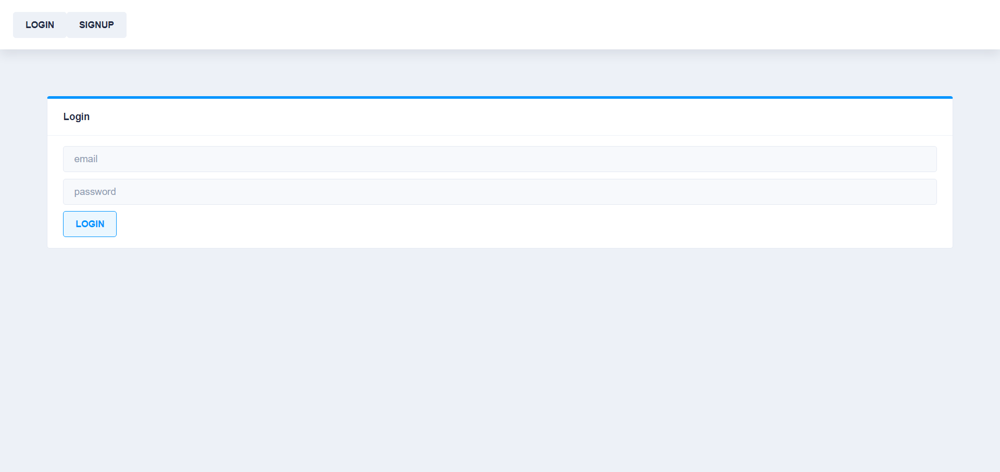
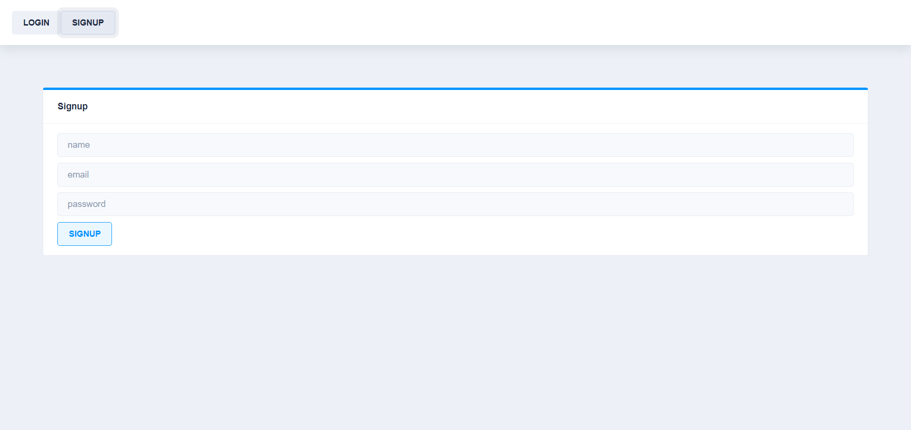
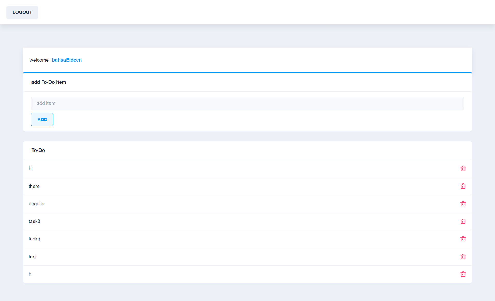

# TodoApp

### a simple angular todo app where you can : 
<ul>
<li>login or signup to access your items</li>
<li>add items</li>
<li>mark items as done or not</li>
<li>remove done items</li>
</ul>

##### login

##### signup

##### the app ui

#### link to the live site https://simple-todo-angular.netlify.app/